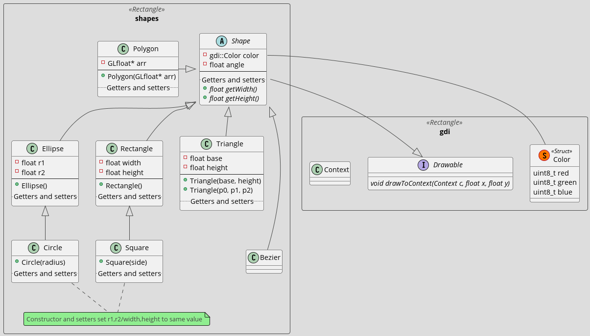

# Introduction

This is an intern project for the core engineering team at [Intelligile](https://www.linkedin.com/company/intelligile). The team members are [Alyaman Maasarani](github.com/AlyamanMas), Oussama Al-Najjar, and Abdul Rahman Al-Tahhan.

It aims to create a platform-independent graphics API, which would map to different APIs depending on the platform (e.g. DirectX for Windows, Metal for macOS, OpenGL/Vulkan for Linux).

# Project Class Diagram

_Note: this is mainly for brainstorming and may not be 100% accurate to the actual project._

# Progress

- [ ] Shapes namespace.
- [ ] GDI namespace interface.
- [ ] GDI OpenGL implementaion.

